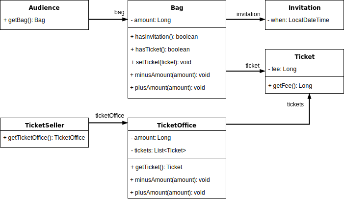
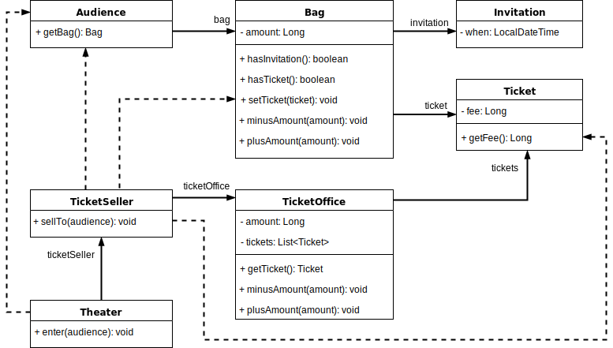
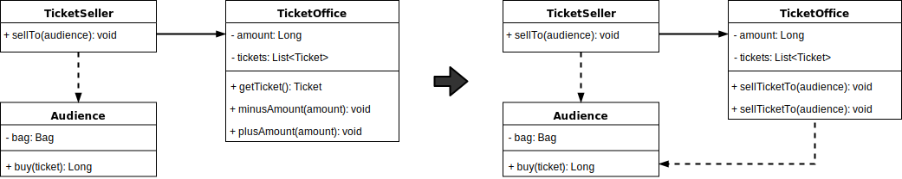

# 객체, 설계
이론과 실무중에서 어느게 우선인가 하는 질문으로 시작하네요.
Robert L. Glass의 이론을 빌어 실무가 먼저이고, 실무의 관찰을 바탕으로 성숙해지는 시점에서 부터 이론이 실무를 추월 한다고 말하는군요.  

"닭이 먼저냐 달걀이 먼저냐" 처럼 우리 삶에 전혀 의미없는 화두가 아닌가 싶지만, 우리의 소프트웨어 개발이 그런 분야의 대표적인 예라고 지은이는 말해요.
그러면서 책의 방향이 이론 증명보다 코드에 치중을 할 거라고 하니 왠지 모를 안도감이 드네요.

## 01. 티켓 판매 애플리케이션 구현하기
이벤트 당첨자에게 **초대권**이 있어 티켓으로 교환 할 수 있고, 그렇지 않으면 **티켓**을 구매해야만 입장할 수 있다고 해요.

초대장에는 초대일자가 있네요.
```java
public class Invitation {
  private LocalDateTime when;
}
```

공연을 관람하려는 사람은 티켓이 있어야 한대요.
```java
@Getter
public class Ticket {
  private Long fee;
}
```

관람하려는 사람은 **가방**을 가질 수 있고, 가방에는 금액과 초대권, 그리고 교환하거나 구매한 티켓을 넣을 수 있어요.
금액(amount)은 넣고(plusAmount) 뺄 수(minusAmount) 있고요.
```java
public class Bag {
  private Ticket ticket;
  private Long amount;

  @Setter
  private Invitation invitation;

  public boolean hasInvitation() {
    return invitation != null;
  }

  public boolean hasTicket() {
    return ticket != null;
  }

  public void minusAmount(Long amount) {
    this.amount -= amount;
  }

  public void plusAmount(Long amount) {
    this.amount += amount;
  }
}
```

가방(Bag)에는
 - 초대장이 없이 금액만 있거나,
 - 초대장과 금액이 같이 있는 경우

위의 경우가 있으니까 생성자를
```java
  public Bag(long amount) {
    this(null, amount);
  }

  public Bag(Invitation invitation, long amount) {
    this.invitation = invitation;
    this.amount = amount;
  }
```
이렇게, 만들어 줬네요.

이제는 **관람객**을 등장 시켜요.
```java
@AllArgsConstructor
public class Audience {
  @Getter
  private Bag bag;
}
```

관람객이 등장했으니까 **매표소**가 있어야 겠군요.  
매표소는
 - 판매나 교환해 줄 티켓(tickets)을 가지고 있고,
 - 판매한 금액(amount)을 가지고 있겠죠.

매표소가 할 수 있는 건
 - 티켓을 꺼내 주고(getTicket)
 - 금액을 받거나(plusAmount)
 - 금액을 되돌려 주거나(minusAmount)

이런 일을 할 수 있어요.
```java
@AllArgsConstructor
public class TicketOffice {
  private Long amount;
  private List<Ticket> tickets = new ArrayList<>();

  public Ticket getTicket() {
    return tickets.remove(0);
  }
  
  public void minusAmount(Long amount) {
    this.amount -= amount;
  }

  public void plusAmount(Long amount) {
    this.amount += amount;
  }
}
```

**판매원**도 있네요. 판매원은 매표소에서 일하니까,
```java
@AllArgsConstructor
public class TicketSeller {
  @Getter
  private TicketOffice office;
}
```

간략히 클래스 다이어그램으로 표현하면 이런 식이네요.
~~TicketOffice 의 tickets 필드가 책에는 누락됐네요.~~



이번에는 **극장**을 만들어요. 입장(enter) 기능이 있는 걸로요.
```java
@AllArgsConstructor
public class Theater {
  private TicketSeller seller;

  public void enter(Audience audience) {
    if (audience.getBag().hasInvitation()) {
      Ticket ticket = seller.getOffice().getTicket();
      audience.getBag().setTicket(ticket);
    }
    else {
      Ticket ticket = seller.getOffice().getTicket();
      audience.getBag().minusAmount(ticket.getFee());
      seller.getOffice().plusAmount(ticket.getFee());
      audience.getBag().setTicket(ticket);
    }
  }
}
```

## 02. 무엇이 문제인가

### 예상을 빗나가는 코드
관람객(Audience)의 가방(Bag)을 극장(Theater)이 함부로 뒤지고, 돈을 꺼내가는 문제점.  
판매원(TicketSeller)도 역시 극장에 의한 수동적인 존재 라는 문제점이 있군요.  
이런 문제점들은 우리의 상식과 괴리가 커서 코드를 읽는 사람과 제대로 의사소통이 안된다고 지적 하네요.

또한, `Theater`의 `enter`메서드를 이해하기 위해서 `Audience`의 `Bag`을 이해하고 `Bag` 내부에 현금과 티켓이 있다는 모든 사실을 동시에 알고 있어야 한대요.

무엇보다 가장 심각한 문제는 `Audience`와 `TicketSeller`를 변경할 경우 `Theater`도 함께 변경해야 한다는 사실이래요.

### 변경에 취약한 코드
관객이 가방이 아닌 다른 것을 이용한다면 `Audience`의 `Bag` 필드를 변경해야 하는데, 그러면 `Theater`의 `enter` 메서드도 변경이 불가피한게 가장 큰 문제.  
이것이 객체 사이의 **의존성(dependency)** 문제라고 하는군요.
과한 의존성을 **결합도(coupling)가 높다**고 하면서요.

## 03. 설계 개선하기
관람객과 판매원을 **자율적인 존재**로 만들면 된대요.

### 자율성을 높이자
`Theater.enter()` 메서드에서 `TicketSeller`의 역할을 떼내고
```java
@AllArgsConstructor
public class Theater {
  private TicketSeller seller;

  public void enter(Audience audience) {
    seller.sellTo(audience);
  }
}
```
 `TicketSeller.sellTo(...)`로 만들면 뭔가 좀 매끄러워진 느낌이 들겠네요.
```java
@AllArgsConstructor
public class TicketSeller {
  private TicketOffice office;

  public void sellTo(Audience audience) {
    if (audience.getBag().hasInvitation()) {
      Ticket ticket = office.getTicket();
      audience.getBag().setTicket(ticket);
    }
    else {
      Ticket ticket = office.getTicket();
      audience.getBag().minusAmount(ticket.getFee());
      office.plusAmount(ticket.getFee());
      audience.getBag().setTicket(ticket);
    }
  }
}
```
이렇게 하니까 `Theater`는 `TicketSeller`의 **인터페이스(interface)**에만 의존하게 됐고, 판매원의 내부적으로 `TicketOffice`가 포함시킨 **구현(implementation)**을 극장은 몰라도 되게 됐어요.



동일한 방식으로 `Audience.buy()`를 만들어서
```java
@AllArgsConstructor
public class Audience {
  private Bag bag;

  public Long buy(Ticket ticket) {
    if (bag.hasInvitation()) {
      bag.setTicket(ticket);
      return 0L;
    }
    else {
      bag.minusAmount(ticket.getFee());
      bag.setTicket(ticket);
      return ticket.getFee();
    }
  }
}
```
`TicketSeller.sellTo(...)`에서 가방에 접근하는 부분을 개선해요.
```java
@AllArgsConstructor
public class TicketSeller {
  private TicketOffice office;

  public void sellTo(Audience audience) {
    final Ticket ticket = office.getTicket();
    final Long profits = audience.buy(ticket);
    office.plusAmount(profits);
  }
}
```



### 무엇이 개선됐는가
관람객과 판매원이 스스로 해야할 일을 해요. 우리가 예상하는 현실적인 과정처럼 바껴서 코드를 읽는 사람과 의사소통이 원활해졌어요.  
그리고 의존관계를 정리하고 역할을 나눴더니 변경이 있어도 대응하기 쉬워졌네요. 예를들면 가방이 지갑으로 대체돼도 `Audience`만 변경하면 되는 거죠.

### 어떻게 한 것인가
현실적인 동작을 직관적으로 따랐고, 객체 각각의 자율성을 높이는 방향을 설계 했을 뿐... ~~DDD 하라는 얘기 같기도 하네요.~~

### 캡슐화와 응집도
다른 객체는 내가 무엇을 하는지 알면 피곤해지는거죠.  
연관성 없는 일은 이임 시키고 꼭 필요한 일만 하는 걸 **응집도(cohesion)가 높다**고 한대요. 객체 스스로 자신의 데이터를 책임지고 처리하는 자율적인 존재로 만드는 게 좋대요.

### 절차지향과 객체지향
데이터의 흐름에 따라 별도의 모듈로 진행하는 방식을 **절차적 프로그래밍(Procedural Programming)** 이라고 한대요. 앞서 해본것처럼 그렇게 하면 직관에 위배되기 쉽다고 해요.  
그리고 데이터의 변경에 의한 영향을 지역적으로 고립시키기 어렵다고 해요. 그래서 변경하기 어려운 코드를 양산하는 경향이 있다네요.

**객체지향 프로그래밍(Object-Oriented Programming)** 은 데이터가 한 모듈 안에서 처리되는 방식을 말해요. 장점은 이미 체험해 봤죠?

### 책임의 이동
절차/객체 지향 방식의 근본적인 차이를 만드는게 **책임의 이동(Shift of reponsibility)** 래요. 여기서 "책임"은 객체지향에서 "기능"을 말하고요.  
처음의 실습 예제에선 `Theater`에 책임이 집중돼 있었는데 **책임의 이동**을 통해서 각각의 객체가 **자신을 스스로 책임**지는 형태로 개선했어요.

### 더 개선할 수 있다
`Audience.buy(...)` 안에서 `Bag`이 너무 수동적이라고 해서
```java
public class Bag {

  ...
 
  public Bag(Invitation invitation, long amount) {
    this.invitation = invitation;
    this.amount = amount;
  }
  
  public Long hold(Ticket ticket) {
    if (hasInvitation()) {
      setTicket(ticket);
      return 0L;
    }
    else {
      minusAmount(ticket.getFee());
      setTicket(ticket);
      return ticket.getFee();
    }
  }

  ...
}
```
`hold(...)`를 추가하고,

```java
@AllArgsConstructor
public class Audience {
  private Bag bag;

  public Long buy(Ticket ticket) {
    return bag.hold(ticket);
  }
}
```
이러면 `Bag`의 응집도가 높아졌어요.

---

`TicketSeller` 역시 `TicketOffice`의 `Ticket`을 맘대로 팔아치우고 `Audience`에게 받은 돈도 알아서 넣어 버리네요.
```java
public class TicketOffice {
  ...

  public void sellTicketTo(Audience audience) {
    final Ticket ticket = getTicket();
    final Long profits = audience.buy(ticket);
    plusAmount(profits);
  }

  ...
}
```



### 그래, 거짓말이다!
직관적인 의식의 흐름(?)을 따른 코드를 이해하기 쉽다는데, 현실에선 매표소가 티켓을 판매원에게 전달하는게 아니잖아요.  
그래서 무생물도 스스로 행동하고 자기 자신을 책임지는 자율적인 존재로 취급하래요. **의인화(anthropomorphism)** 이라고...

## 04. 객체지향 설계

### 설계가 왜 필요한가
설계와 코딩 중 어떤게 중요한게 아니라, 둘은 하나의 것과 같다고 말해요. 설계는 코딩의 일부이며 코딩없이 설계를 검증할 수 없다면서요.  
그렇다면 좋은 설계는
- 기능을 충실히 구현
- 변화에 잘 대응할 수 있는 설계

### 객체지향 설계
협력하는 객체 사이의 의존성을 적절하게 관리하는 게 훌륭한 설계라는 군요.
