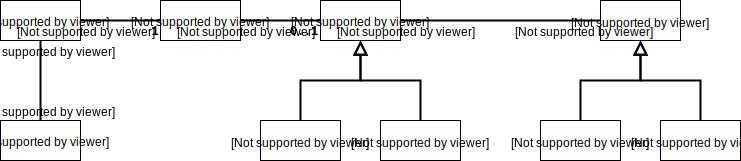

# 객체지향 프로그래밍

## 01. 영화 예매 시스템

### 요구사항 살펴보기
1. "영화" 에는 제목, 상영시간 가격이 있고,
2. "상영" 은 실제 관객들이 영화를 관람하는 사건을 표현하는데, 한번 이상 상영할 수 있다고 해요.
3. 예매자는 요금 할인을 받는데
   - "할인 조건"은 가격 할인 여부를 결정하고
     - 순서 조건
     - 기간 조건이 있어요.
   - "할인 정책"은 할인 요금을 결정하는데
     - 금액 할인 정책
     - 비율 할인 정책이 있어요.

<table>
<thead>
  <tr>
    <th>영화</th>
    <th>할인 정책</th>
    <th>할인 조건</th>
  </tr>
</thead>
<tbody>
  <tr>
    <td rowspan="4">아바타<br>(가격: 10,0000원)</td>
    <td rowspan="4">금액 할인 정책<br>(할인액: 800원)</td>
    <td>순번 조건 / 조조 상영</td>
  </tr>
  <tr>
    <td>순번 조건 / 10회 상영</td>
  </tr>
  <tr>
    <td>기간 조건 / 월요일 10:00~12:00 상영 시작</td>
  </tr>
  <tr>
    <td>기간 조건 / 목요일 18:00~12:00 상영 시작</td>
  </tr>
</tbody>
<tbody>
  <tr>
    <td rowspan="3">타이타닉<br>(가격: 11,0000원)</td>
    <td rowspan="3">금액 할인 정책<br>(할인률: 10%)</td>
    <td>기간 조건 / 화요일 14:00~17:00 상영 시작</td>
  </tr>
  <tr>
    <td>순번 조건 / 2회 상영</td>
  </tr>
  <tr>
    <td>기간 조건 / 목요일 10:00~14:00 상영 시작</td>
  </tr>

</tbody>
<tbody>
  <tr>
    <td>스타워즈:깨어난포스<br>가격(10,000원)</td>
    <td>없음</td>
    <td>없음</td>
  </tr>
</tbody>
</table>

이런 규칙의 예시에 맞춰서 예매를 하면

| 항목   | 내용              |
| ---- | --------------- |
| 제목   | 아바타             |
| 상영정보 | 00년 0월 0일 7회 0시 |
| 인원   | 2명              |
| 정가   | 20,000원         |
| 결제금액 | 18,400원         |

이렇게 된다는 거죠.

## 02. 객체지향 프로그래밍을 향해

### 협력, 객체, 클래스
시작할 때 먼저 클래스를 고민하지 말라고 하네요.
1. 어떤 클래스 전에 어떤 객체들이 필요한지 고민하고
2. 객체를 독립적인 존재가 아닌 기능 구현을 위해 협력하는 공동체의 일원으로 보래요.

### 도메인의 구조를 따르는 프로그램 구조
**도메인(domain)** 이라는 용어는 문제를 해결하기 위해 <u>*사용자가 프로그램을 사용하는 분야*</u>를 일컫는다고 해요.

객체지향 패러다임은 도메인을 구성하는 개념들이 매끄럽게 객체와 클래스로 연결되고요.



일반적으로 도메인 개념의 이름과 동일하거나 유사하게 클래스 이름을 짓고, 클래스 구조 또한 도메인 구조와 유사한 형태를 띠어야 한대요.



### 클래스 구현하기
```java
public class Screening {
  private Movie movie;
  private int sequence;
  private LocalDateTime whenScreened;
  
  public LocalDateTime getStartTime() {
    return whenScreened;
  }
  
  public boolean isSequence(int sequence) {
    return this.sequence == sequence;
  }

  public Money getMovieFee() {
    return movie.getFee();
  }
}
```
접근수정자에 주목하네요. private과 public을 적절히 구분해서 객체의 자율성을 보장하고, 개발자에게 구현의 자유를 제공한대요. ~~지금까지 이런 자유를 만끽해본적이 없는 것 같은데...~~ 

#### 자율적인 객체
중요한 사실,
1. 객체는 상태(state)와 행동(behavior)를 가지는 존재이고,
2. 객체는 스스로 판단하고 행동하는 **자율적인 존재**라는 것 이래요.

객체의 상태와 행동을 내부에서 함께 묶는 것을 **캡슐화**라고 하고,
캡슐화된 상태나 행동을 **접근 제어(Access control)** 할 수 있도록 public, protected, private 등과 같은 **접근 수정자(Access modifier)** 가 있대요.

그렇게 접근 수정자로 외부에서 접근 가능한 이를 **Public Interface** 라고 부르고, 접근 불가능하고 내부에서만 접근 가능한 걸 **구현(Implementation)** 이라고 부른대요.  
이렇게 **인터페이스와 구현의 분리(ISP)** 는 설계의 원칙이 되는 거네요.

#### 프로그래머의 자유
클래스 작성자(Class creator)와 클라이언트 프로그래머(Client Programmer)로 분리하는 게 유용하다 하네요.
이러면 구현체에 대한 접근이 제한되면서 클라이언트 프로그래머에게 자율성이 보장되고, 이를 **구현 은닉(Implementation hiding)** 이라고 부르고요.

### 협력하는 객체들의 공동체
`Screening.reserve(...)` 를 보면 `calculateFee` 라는 private 메서드를 호출해서 요금을 계산해요.
```java
public class Screening {
  ...

  public Reservation reserve(Customer customer, int audienceCount) {
    return new Reservation(customer, this, calculateFee(audienceCount), audienceCount);
  }

  private Money calculateFee(int audienceCount) {
    return movie.calculationMovieFee(this).times(audienceCount);
  }
    
  ...
}
```

```java
public class Reservation {
  private Customer customer;
  private Screening Screening;
  private Money fee;
  private int audienceCount;

  public Reservation(Customer customer, Screening Screening, Money fee, int audienceCount) {
    this.customer = customer;
    this.Screening = Screening;
    this.fee = fee;
    this.audienceCount = audienceCount;
  }
}
```
예매를 위해 `Screening`, `Movie`, `Reservation` 은 서로를 호출하며 상호작용 하는데 이를 **협력(Collaboration)** 이라고 부른대요.


### 협력에 관한 짧은 이야기
각 객체 간에는 요청과 응답을 한대요. 상호작용을 하는 건데, 그 유일한 방법은 **메세지를 전송(send a message)** 이고, **메세지를 수신(receive a message)** 이고요.  
메세지를 처리하는 자신만의 방법법을 **메서드(method)** 라고 부르고요.

이런 메서드와 메세지를 잘 구분하는 것에서 부터 **다형성(polymorphism)** 의 개념이 출발 한대요.

## 03. 할인 요금 구하기

### 할인 요금 계산을 위한 협력 시작하기
```java
public class Movie {
  private String title;
  private Duration runningTime;
  private Money fee;
  private DiscountPolicy discountPolicy;

  public Movie(String title, Duration runningTime, Money fee, DiscountPolicy discountPolicy) {
    this.title = title;
    this.runningTime = runningTime;
    this.fee = fee;
    this.discountPolicy = discountPolicy;
  }

  public Money getFee() {
    return fee;
  }

  public Money calculateMovieFee(Screening screening) {
    return fee.minus(discountPolicy.calculateDiscountAmount(screening));
  }
}
```
`calculateMovieFee` 메서드는 `discountPolicy` 에 `calculateDiscountAmount(...)` 메세지를 전송해서 할인 요금을 계산해요. 여기서 이상한 점!  
이 메서드는 어떤 할인 정책을 사용하는지 결정하는 부분이 없이 `discountPolicy` 에 메세지를 보낼 뿐.

익숙치 않으면 객체지향 패러다임에 익숙하지 않은거래요. 😭
1. **상속(inheritance)** 과
2. **다형성** 이 숨겨져 있었대요.

그리고 그 기반에 **추상화(abstraction)** 라는 원리가 숨어 있다는데...

### 할인 정책과 할인 조건
할인 정책별로 유사한 기능이 있기 때문에 **추상 클래스(abstract class)** 로 구현해요.
```java
public abstract class DiscountPolicy {
  private List<DiscountCondition> conditions = new ArrayList<>();

  public DiscountPolicy(DiscountCondition... conditions) {
    this.conditions = Arrays.asList(conditions);
  }

  public Money calculateDiscountAmount(Screening screening) {
    for (DiscountCondition each : conditions) {
      if (each.isSatisfiedBy(screening)) {
        return getDiscountAmount(screening);
      }
    }

    return Money.ZERO;
  }

  abstract protected Money getDiscountAmount(Screening Screening);
}
```
**추상 메서드(Abstract method)** 를 사용해서 각 할인 정책별로 요금 계산을 해요. 부모 클래스가 기본적인 처리를 하고 자식 클래스에게 세부 처리를 이임하는 걸 **TEMPLATE METHOD 패턴** 이라고 부르는 군요.

```java
public interface DiscountCondition {
    boolean isSatisfiedBy(Screening screening);
}
```
할인 조건에 만족하는지를 판단하는 역할을 하는 인터페이스를 만들고,

```java
public class SequenceCondition implements DiscountCondition {
    private int sequence;

    public SequenceCondition(int sequence) {
        this.sequence = sequence;
    }

    public boolean isSatisfiedBy(Screening screening) {
        return screening.isSequence(sequence);
    }
}
```
상영 순번으로 할인하는 구현체를 만들어요.

```java
public class PeriodCondition implements DiscountCondition {
  private DayOfWeek dayOfWeek;
  private LocalTime startTime;
  private LocalTime endTime;

  public PeriodCondition(DayOfWeek dayOfWeek, LocalTime startTime, LocalTime endTime) {
    this.dayOfWeek = dayOfWeek;
    this.startTime = startTime;
    this.endTime = endTime;
  }

  public boolean isSatisfiedBy(Screening screening) {
    return screening.getStartTime().getDayOfWeek().equals(dayOfWeek) &&
        startTime.compareTo(screening.getStartTime().toLocalTime()) <= 0 &&
        endTime.compareTo(screening.getStartTime().toLocalTime()) >= 0;
  }
}
```
특정 기간으로 할인하는 구현체도 만들고요.

```java
public class AmountDiscountPolicy extends DiscountPolicy {
  private Money discountAmount;

  public AmountDiscountPolicy(Money discountAmount, DiscountCondition... conditions) {
    super(conditions);
    this.discountAmount = discountAmount;
  }

  @Override
  protected Money getDiscountAmount(Screening screening) {
    return discountAmount;
  }
}
```
이제는 정책을 구현해요. 일정한 할인 조건을 만족할 경우 일정한 금액을 할인해주는 금액 할인 정책의 구현체 에요.

```java
public class PercentDiscountPolicy extends DiscountPolicy {
  private double percent;

  public PercentDiscountPolicy(double percent, DiscountCondition... conditions) {
    super(conditions);
    this.percent = percent;
  }

  @Override
  protected Money getDiscountAmount(Screening screening) {
    return screening.getMovieFee().times(percent);
  }
}
```
할인 비율을 차감하는 구현체 고요.


## 04. 상속과 다형성

### 차이에 의한 프로그래밍
`AmountDiscountPolicy` 와 `PercentDiscountPolicy` 는 `DiscountPolicy` 추상 클래스를 상속하죠.  
이처럼 부모 클래스와 다른 부분만을 추가해서 새로운 클래스를 쉽고 빠르게 만드는게 **차이에 의한 프로그래밍(Programming by difference)** 라고 한대요.

### 상속과 인터페이스
인터페이스를 포함하게 되는 자식 클래스들은 부모 클래스와 동일한 타입으로 간주 할 수 있어요.
`Movie.calculateMovieFee(...)` 를 보면 `AmountDiscountPolicy` 와 `PercentDiscountPolicy` 모두 `DiscountPolicy` 를 대신해서 `Movie`와 협력 할 수 있는 거죠.  
이런 식으로 자식 클래스가 부모 클래스를 대신하는 걸 **업캐스팅(upcasting)** 이라고 부른대요.

### 다형성
코드 상에서 `Movie` 는 `DiscountPolicy` 에게 메세지를 전송하지만, 실제로 어떤 메서드(구현체)가 실행 될 지는 수신하는 객체의 클래스가 무엇이나 따라 달라지잖아요. 이걸 **다형성** 이라고 부른대요.

## 05. 추상화와 유연성

### 추상화의 힘
할인 정책은 금액과 비율 할인 정책을 포괄하는 추상적인 개념이에요. 할인 조건도 마찬가지고요.

추상화로 얻는 장점은 
- 요구사항의 정책을 높은 수준에서 서술할 수 있다는 것과
- 설계가 좀더 유연해 진다는 것 이래요.

### 추상 클래스와 인터페이스 트레이드오프
```java
public interface DiscountPolicy {
  Money calculateDiscountAmount(Screening screening);
}
```
`DiscountPolicy` 를 interface 로 바꾸고, `DefaultDiscountPolicy` 추상 클래스를 새로 만들어요.

```java
public abstract class DefaultDiscountPolicy implements DiscountPolicy {
  private List<DiscountCondition> conditions = new ArrayList<>();

  public DefaultDiscountPolicy(DiscountCondition... conditions) {
    this.conditions = Arrays.asList(conditions);
  }

  @Override
  public Money calculateDiscountAmount(Screening screening) {
    for (DiscountCondition each : conditions) {
      if (each.isSatisfiedBy(screening)) {
        return getDiscountAmount(screening);
      }
    }

    return Money.ZERO;
  }

  protected abstract Money getDiscountAmount(Screening Screening);
}
```
그리고 `NonDiscountPolicy` 가 `DisplayPolicy` 를 구현하면 개념적인 혼란과 결합을 제거할 수 있대요.
```java
public class NonDiscountPolicy implements DiscountPolicy {
    @Override
    public Money calculateDiscountAmount(Screening screening) {
        return Money.ZERO;
    }
}
```


인터페이스를 사용한 것이 더 좋은 설계라네요. 과한 듯 싶지만 이런 구현과 관련된 모든 사항이 트레이드 오프의 대상이 될 수 있다고 보여준 것 같아요.

### 합성
상속보다 **합성(composition)** 이 더 좋은 방법이라는 이야기를 많이 들었어요.

상속이 아닌 인터페이스에 정의된 메세지를 통해서만 코드를 재사용하는 방법은 **합성** 이라고 부른대요.
이는
 - 구현을 효과적으로 캡슐화 할 수 있고,
 - 의존하는 인스턴스를 교체하는 것이 비교적 쉬워서

상속이 가지는 문제점을 해결 할 수 있어요.

