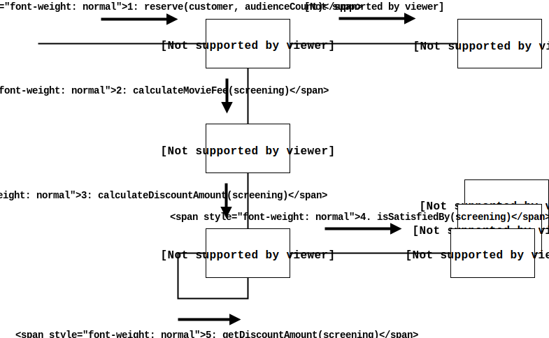

# 역할, 책임, 협력

## 01. 협력

### 영화 예매 시스템 돌아보기

객체들이 어플리케이션 기능을 구현하기 위해 수행하는 상호작용을 **협력** 이라고 해요.  
그러면서 객체가 협력에 참여하기 위해 수행하는 로직은 **책임** 이라고 하고, 그 책임이 모여 객체가 수행하는 **역할** 이 구성돼요.

### 협력
두 객체 사이의 협력은 하나의 객체가 다른 객체에게 도움을 요청 할 때 시작된대요. **메세지 전송(Message sending)** 은 객체 사이의 협력을 위한 유일한 소통 수단이고.  
메세지를 수신한 객체는 **메서드** 를 실행해서 요청에 응답해요. 실행하는 처리방식은 수신한 객체가 알아서 하고 스스로 하기 때문에 자율적인 존재인거죠.

### 협력이 설계를 위한 문맥을 결정한다
객체란 상태(state)와 행동(behavior)을 함께 캡슐화하는 실행 단위에요. 객체의 행동을 결정하는 것이 협력이라면 객체의 상태를 결정하는 것은 행동이죠.
물론 자율적인 존재로서 행동과 상태를 동시에 가지고서요.  
그렇게 객체간의 협력은 설계에 필요한 일종의 **문맥(Context)** 를 제공해요.

## 02. 책임

### 책임이란 무엇인가
협력 이후에 해야 할 건, 행동을 수행할 적절한 객체를 찾아 참여하는 행동을 **책임** 이라고 해요. 책임은 크게  

**하는 것(doing)**
 - 객체를 생성하거나 계산을 수행하는 등의 스스로 하는 것
 - 다른 객체의 행동을 시작시키는 것
 - 다른 객체의 활동을 제어하고 조절하는 것

**아는 것(knowing)**
- 사적인 정보에 관해 아는 것
- 관련된 객체에 관해 아는 것
- 자신이 유도하거나 계산할 수 있는 것에 관해 아는 것

으로 범주를 나눌 수 있어요.  
둘은 밀접하게 연관돼 있고, 이것이 객체에게 책임을 할당하기 위한 가장 기본적인 원칙에 대한 힌트를 제공해요.

책임은 객체지향 설계의 핵심이래요.  
크레이그 라만 曰 **"객체지향 개발에서 가장 중요한 능력은 책임을 능숙하게 소프트웨어 객체에 할당하는 것"** 이라고 했대요.

### 책임 할당
자율적인 객체를 만드는 기본적인 방법은 책임 수행에 필요한 정보를 가장 잘 아는 전문가에게 할당하는 건데 이를 **INFORMATION EXPERT(정보 전문가) 패턴** 이라고 해요. 이건 어쩌면 우리의 일상과 유사해요, 어떤 일을 처리할 때 전문가에게 도움을 청하는 게.

### 책임 주도 설계
협력을 설계하기 위해서는 책임에 초점을 맞춰야 한단 걸 얘기했네요. 책임을 찾고 수행할 적절한 객체를 찾아 책임을 할당해주는 게 **책임주도설계(RDD; Responsibility-Driven Design)** 래요.

- 시스템이 사용자에게 제공해야 하는 기능인 책임을 파악하고
- 시스템 책임을 더 작은 책임으로 분할하고
- 분할된 책임을 수행할 적절한 객체(또는 역할)에게 할당하고
- 객체가 책임을 수행하면서 다른 객체의 도움이 필요할 때 또 적절히 책임에 맞는 객체를 찾고
- 해당 객체(또는 역할)들이 책임을 할당하면서 서로 협력하게 하는 것

이것이 RDD의 과정을 정리한 것 이네요.

### 메세지가 객체를 결정한다.
책임 할당에 필요한 메세지가 객체를 선택하는 것이 중요 뽀인트!  
메세지가 객체를 선택해야하는 이유
1. 객체가 최소한의 인터페이스를 가질 수 있고
2. 객체는 충분히 추상적인 인터페이스를 가질 수 있게 된대요.

### 행동이 상태를 결정한다
객체의 행동보다 상태를 먼저 고려하면 캡슐화를 저해하고 변경 용이성도 떨어지고. 이런 걸 **데이터 주도 설계(Data-Driven Desgin)** 이라고 부르기도 했다는데, 경계해야 할 것 같아요.  
상태는 단지 객체가 행동을 정상적으로 수행하기 위해 필요한 재료일 뿐이래요.

## 03. 역할

### 역할과 협력
객체가 협력안에서 수행하는 책임의 집합을 **역할** 이라고 불러요.  
책임 할당 과정은
1. 영화를 예매할 수 있는 적절한 역할이 무엇인지 찾는 것이고
2. 역할을 수행할 객체를 찾는 거에요.

### 유연하고 재사용 가능한 협력
*할인요금을 계산하자* 는 메세지를 수행할 때, 가격 과 비율 할인을 모두 수용하지만 코드 중복은 피해야 해요. 두 객체는 할인 요금을 계산하는 동일한 책임을 수행하는데, 상황에 맞게 교체 할 수 있는 **역할** 을 가져요.  
상황에 따라 교체하는 역할은 두 객체를 포괄하는 **추상화** 에요.

> 역할은 다른 것으로 교체할 수 있는 책임의 집합이다.

### 객체 대 역할
역할은 상대적으로 알려지지도 않고 주목도 못 받았지만 중요한 개념이래요.  
역할을 설계의 중심으로 보는 **역할 모델링(Role Modeling)** 도 있대요.

### 역할과 추상화
역할은 공동의 책임을 바탕으로 객체의 종류를 숨길 수 있기 때문에 추상화로 볼 수 있어요.

추상화의 장점은 상위의 세부사항을 생략하고 핵심적인 개념을 강조 할 수 있다는 거에요.

### 배우와 배역
하나의 배역을 수행하는데 배우는 여러명이 될 수 있는 것처럼 역할의 의미를 생각해 볼 수 있네요.  
책에서 예시 대상을 잘 잡아 준 것 같아요 :)