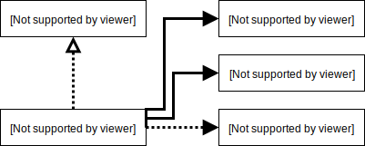
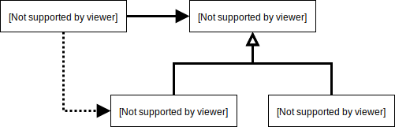

# 의존성 관리하기
협력은 필수인데, 과도한 협력은 노노!

## 01 의존성 이해하기
### 변경과 의존성
**실행시점** 과 **구현시점** 의 의존 상태는 달라요.  
다형성으로 생기는 의존성은 실행시점에 변하게 되니까요. 모든 초점은 ***변경*** 에 맞춰져
있어요. 의존성 역시.  

- 인스턴스 변수로 사용되며,
- 메서드 인자로 사용되며,
- 인터페이스를 구현하며

의존을 하게 되는데요, 각자 표현을 다르게 해주는게 유용하대요. UML 이 그런거겠죠.



### 의존성 전이
협력은 하나의 의존이 얽히고 섥혀서 또 의존을 만드는 **의존성 전이** 의 연속이죠. 하지만 매번
의존성이 전이되는 건 아니고 **변경될 수 있는 가능성** 에서 비롯되니까 캡슐화를 잘 해보자는
거에요.

**직접 의존성(direct dependency)** 은 `PeriodCondition` 이 `Screening` 에
의존하는 경우를 말한대요. 대놓고 의존한다는 얘기고, **간접 의존(indirect dependency)**
는 명시적으로 드러나지 않는 의존이라는데... ~~뭐 쓰지는 않는데 데려온 애한테 달려있는
의존성을 말하는 걸까요?~~

### 런타임 의존성과 컴파일타임 의존성
컴파일타임 의존성은 `interface` 로 분리된 설계가 되는데 런타임 의존성은 실제 구현 객체
간에 협력이 이뤄지는 거에요. 당연히 이렇게 해야 좋은거겠죠. 코드 작성 시점에는 구현된 대상이
아닌 오퍼레이션에 의존하고 실행 시점에 실제 구현된 객체와 협력하면 유연하고 재사용 가능한
설계를 할 수 있어요.  
클래스가 협력할 구체적인 대상 클래스를 알면 안된다는 거죠.

### 컨텍스트 독립성
조금 심오하지만 만약 `Movie` 클래스 안에 `PercentDiscountPolicy` 가 컴파일타임
의존성을 가진다면 `Movie` 에서 *비율할인 정책이 적용된 영화 요금을 계산* 을 할 거라는 걸
가정하는 거에요.

클래스가 특정한 문맥에 강하게 결합될수록 안좋겠네요. 최소한의 가정만으로 이뤄지면 다른데서도
쓰기 좋겠어요, 당연하지만. 이걸 **컨텍스트 독립성** 이라고 한대요.  
~~"너 오늘 집에 가지 말고 우리집에서 자고 갈래?" 보다는 "라면먹고 갈래?" 라고 하면 성공
확률이 높을 거라는... 막, 적절한 예시는 아닌 것 같네요.~~

### 의존성 해결하기
컴파일타임 의존성은 구체적인 런타임 의존성으로 바뀌잖아요. 그런걸 **의존성 해결** 이라고
한대요. 일반적으로는,

- 생성자를 통해,
- setter 메서드를 통해,
- 메서드 인자를 통해,

의존성을 해결하는데요, ~~가능하면 생성자에서 의존하는게 명확하지 않을까요? (뇌피셜)~~

## 02 유연한 설계
### 의존성과 결합도
의존성 과하면 문제된다고 말했었죠?  
의존하는 척도를 **결합도** 라고 일컫으며 "느슨한 결합도", "약한 결합도" 라고 표현해요. 

### 추상화에 의존하세요
"구체 클래스 < 추상 클래스 < 인터페이스" 이렇게 될수록 결합도가 느슨해져요.

### 명시적인 의존성

```java
class Movie {
  ...
  private DiscountPolicy discountPolicy;
  
  public Movie(String title, Duration runningTime, Money fee) {
    ...
    this.discountPolicy = new AmountDiscountPolicy(...); 
  }
  ...
}
```

`Movie` 에서 필드에는 `DiscountPolicy` 로 타입을 정해놓고
`AmountDiscountPolicy` 인스턴스를 직접 생성해서 대입하는데...  

  

이런식이죠. 이걸 이렇게 해보면,
```java
class Movie {
  ...
  private DiscountPolicy discountPolicy;
  
  public Movie(... DiscountPolicy discountPolicy) {
    ...
    this.discountPolicy = discountPolicy; 
  }
  ...
}
```
런타임 시점에 선택적으로 할인정책 인스턴스를 전달 할 수 있어요.  
어떤 긴 메스드 내부 어딘가에서 인스턴스를 생성하는 코드를 파악하는 건 쉽지 않다며,

### new 는 해로워요
잘못쓰면 극단적으로 결합도가 높아져요.

- 구체 클래스 이름을 직접 기술해야 하고,
- 생성자의 인자에 대한 구성도 알아야 하기에

결합도가 높아져요.  
인스턴스 생성은 요청하는 쪽에서 하라는 거에요. 그러면 올바르게 책임이 분리 될 수 있어요.

### 가끔은 생성해도 무방하다
암묵적(?) 인자의 경우에는 가용성등의 이유로 사용 가능 하다고 볼 수 있겠어요. 궁색하지만
"설계는 트레이드오프 활동" 이라고...

### 표준 클래스에 대한 의존은 해롭지 않다
뭐... 기본적인 클래스들. `java.lang.*`, `util`, `io`, `net` 등등은 일반적으로 그냥
많이 쓰니깐 딱히 염두하지 않아도 될 것 같아요.

#### 컨텍스트 확장하기
```java
class Movie {
  public Movie(String title, Duration runningTime, Money fee) {
    this(title, runningTime, fee, null);
  }
  
  public Movie(String title, Duration runningTime, Money fee, DiscountPolicy discountPolicy) {
    ...
    this.discountPolicy = discountPolicy;
  }
  
  public Money calculateMovieFee(Screening screening) {
    if (discountPolicy == null) return fee;
    
    return fee.minus(discountPolicy.calculateDiscountAmount(screening));
  }
}
```

생성자 체이닝으로 '할인이 없는 경우' 까지도 잘 구현 된 것 같지만, 아쉬운게 한가지 있어요.
`if (discountPolicy == null) return fee;` 이 부분인데요. '할인이 없는 경우'
때문에 계산하는 `calculateMovieFee(...)` 메서드가 변경이 생긴거죠.

그래서 `if` 구문을 추가할 필요없이, 다형성으로 `NoneDiscountPolicy` 를 구현하는 거죠.
```java
class NoneDiscountPolicy implements DiscountPolicy {
  @Overried
  protected Money calculateDiscountAmount(Screening screening) {
    return Money.ZERO;
  }
}
```
이렇게 '할인이 없는 경우' 를 위한 정책을 만들고요.  
```java
class Movie {
  public Movie(String title, Duration runningTime, Money fee) {
    //this(title, runningTime, fee, null);
    this(title, runningTime, fee, new NoneDiscountPolicy());
  }

  ...
  
  public Money calculateMovieFee(Screening screening) {
    return fee.minus(discountPolicy.calculateDiscountAmount(screening));
  }
}
```
이렇게 해주면 `calculateMovieFee(...)` 를 변경없이 처리 할 수 있는 거죠. 맘에 드네요!

### 조합 가능한 행동
객체를 어떻게(how) 하는지 주저리주저리 구술하지 않고도 조합을 통해서 무엇(what)을 하는지
충분히 표현 할 수 있었어요.  
메세지에서 추상적인 키워드로 클래스 이름을 만들고, 비지니스 로직을 캡슐화해서 조합된 코드
만으로 쉽게 행동을 예상하고 이해 할 수 있어요.

이 모든게 의존성 관리에서 기인한다는 사실!
