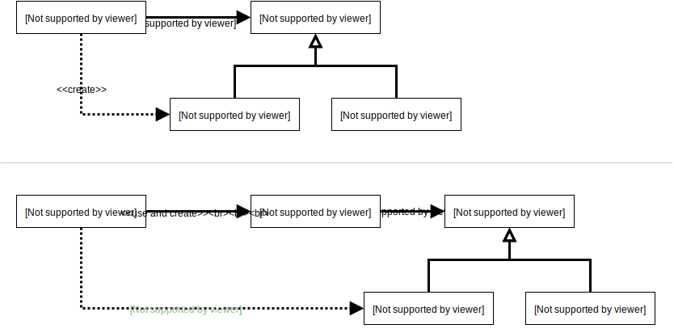
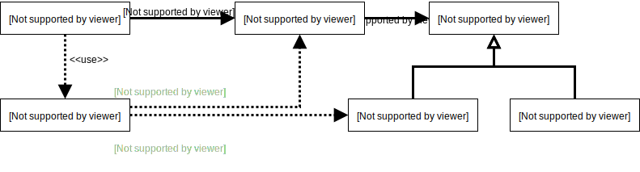
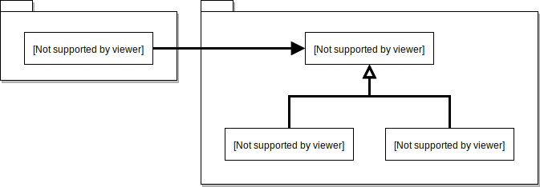
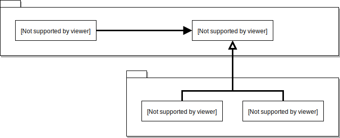

# 유연한 설계

## 01 개방-폐쇄 원칙
> 소프트웨어 개체(클래스, 모듈, 함수 등등)는 확장에 대해 열려 있어야 하고, 수정에 대해서는
> 닫혀 있어야 한다.  
> - Robert C. Martin

뭔소린지... 뜻을 좀 풀어보면,

- **확장에 열려있다**: 요구사항이 변경 되면 새로운 __동작__ 을 추가해서 기능을 확장한 다는
  거,
- **수정에 닫혔있다**: 기존 코드를 __수정__ 하지 않고 동작을 추가하거나 변경할 수 있다는
  거에요.

### 컴파일타임 의존성을 고정시키고 런타임 의존성을 변경하래요.
그림 한방으로 설명이 가능하죠.  


### 추상화가 핵심이래요.
개방-패쇄 원칙은 **추상화에 의존하는 것** 이라고 하네요. 추상화를 통해 생략된 부분을 확장할
수 있게 하는 건데, 코드로 옮기면 다음과 같을 수 있겠어요.  
```java
abstract class DiscountPolicy {
  private List<DiscountCondition> conditions = new ArrayList<>();
  
  public Money caclulateDiscountAmount(Screening screening) {
    for (DiscountCondition condition : conditions)
      if (condition.isSatisfiedBy(screening))
        return getDiscountAmount(screening);
      
    return screening.getMovieFee();
  }

  protected abstract Money getDiscountAmount(Screening screening);
}
```
이 `DiscountPolicy` 와 의존하는 건,  
```java
class Movie {
  private DiscountPolicy discountPolicy;
  
  public Movie(..., DiscountPolicy discountPolicy) {
    ...
    this.discountPolicy = discountPolicy;
  }
  
  public Money calculateMovieFee(Screening screening) {
    return fee.minus(discountPolicy.calculateDiscountAmount(screening));
  }
}
```
이러면 `Movie` 에서 의존된 `DiscountPolicy` 가 확장 가능하고, 추상화로 의존되어 폐쇄가
가능해지는 거죠.

## 02 생성 사용 분리
부적절한 곳에서 객체 생성을 하는게 문제에요. 애초에 `DiscountPolicy` 생성 주체를
`Client` 가 지녀야 하는거죠, `Movie` 가 아니라.  


### FACTORY 추가하기
저렇게 해놨는데, `Client` 도 `Movie` 를 생성하는게 딱히 맘에 들지 않는다면,  
```java
class Factory {
  public Movie createBTSMovie() {
    return new Movie(
                "아!방탄!", 
                Duration.ofMinutes(120),
                Money.wons(10000),
                new AmountDiscountPolicy(...));
  }
}
```
이렇게 FACTORY 를 만들고,  
```java
class Client {
  private Factory factory;
  
  public Client(Factory factory) {
    this.factory = factory;
  }
  
  public Money getBTSFee() {
    Movie bts = factory.createBTSMovie();
    return bts.getFee();
  }
}
```
생성의 책임을 `Factory` 에게 넘기고 사용만 하면 되겠어요. 그러면 `Client` 는 `Movie`
생성에 필요한 정보를 알 필요가 없어지는 거에요.



### 순수한 가공물에게 책임 할당하기
객체지향은 실세계의 모방이 아니래요. 도메인의 본질적인 개념 표현하는 추상화로 시작하지만,
거기에 만족스럽지 못하면 **인공적인 객체를 만들어** 야 한다고 해요.  
객체지향이 실세계를 모방해야 하는 강박보다는 **실용적인 창조** 를 더 잘하라고 하네요. 이런
의미로 **PURE FABRICATION 패턴** 이 있고요.

## 03 의존성 주입
몰래 하지 말라고 해요. SERVICE LOCATOR 패턴... 뭐가 좋은거죠? 음... 안좋은 것 같아요.
예시 코드는 멀티스레드 환경에서 static 변수가 다른 스레드에 의해서 오염될 가능성도 있어
보이고...

## 04 의존성 역전 원칙
1. 상위 수준의 모듈은 하위 수준의 모듈에 의존해선 안되고 추상화에 의존해야 하고,
2. 추상화는 구체적인 사항에 의존하지 않고, 구체적인 사항이 추상화에 의존해야 하는데

이게 **의존성 역전 원칙(Dependency Inversion Principle, DIP)** 래요.

### 의존성 역전 원칙과 패키지
  

전통적인 모듈 구조는 위 그림처럼 UML 패키지가 그려지는데, 의존성 역전 원칙에 따르면,  



이처럼 나오는 구조가 더 적적할 것 같아요. 의존성 역전 원칙에 따라 상위 수준의 협력 흐름을
재사용하기 위해서는 추상화가 제공하는 인터페이스의 소유권 역시 역전해야 하니까요.

## 05 유연성에 대한 조언

### 유연한 설계를 유연성이 필요할 때만 옳다
유연한 설계라는 말의 이면에는 복잡한 설계라는 의미가 숨어있대요. 유연성은 항상 복잡성을
수반하고, 설계가 유연할수록 클래스 구조와 객체 구조 사이의 거리는 점점 멀어진대요. **복잡성이
필요한 이유와 합리적인 근거를 제시하지 않는다면 어는 누구도 만족스러운 해법이라고 생각치
않는다** 는 말이 와 닿네요. **불필요한 유연성은 불필요한 복잡성을 낳는다** 는 것 역시.

### 협력과 책임이 중요하다
책임을 할당하고 협력의 균형을 맞추는게 객체를 "생성하는 책임" 을 할당하는 것보다 우선이에요.
균현을 잘 잡은 상태에서는 생성하는 책임자를 선택하는게 간단한 작업이래요.~~진짜???~~  

유연한 설계는 필요할 때 쓰자!  
역시나 역할, 책임, 협력에 집중해야만 유연한 설계를 할 수 있다는 거네요. 끝~
