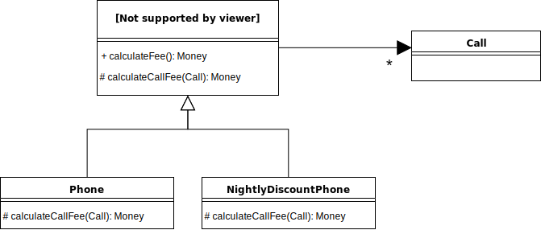

# 상속과 코드 재사용
코드 재사용은 **중복된 코드를 제거** 하려는 의도를 가지고 있다고 해요.

## 01 상속과 중복 코드
중복인지 아닌지 판단하는게 일단, 어렵죠.

### DRY 원칙
**Don't Repeat Yourself** 라고 해서 재사용 하지 말라는 거죠. 중복 코드를 제거하는 목적 역시 **변경** 이라는 것에 있어요. 요구사항이 발생했는데 함께 수정해야한다면 중복이라고 할 수 있겠대요.

### 중복과 변경
코드를 봐야할 것 같아요.  
https://github.com/eternity-oop/object/tree/master/chapter10/src/main/java/org/eternity/billing/step01

### 상속을 이용해서 중복 코드 제거하기
간단하게 기존 코드의 대부분을 재사용 할 수 있는 방법이에요. 하지만 문제점이 있어요. **상속은 결합도를 높이거든요**.

## 02 취약한 기반 클래스 문제
별 생각 없이 사용하던 것들인데 문제가 있었네요.

### 불필요한 인터페이스 상속 문제
`java.util.Stack` 이 `Vector` 를 상속하면서 스택 자료구조인데 특정 인덱스에 `add(index, value)` 메서드로 룰을 깰 수 있네요.  
비슷하게 `java.util.Properties` 는 `Hashtable` 을 상속해서 `String` 타입이 아닌 객체를 넣을 수 있어요.

### 메서드 오버라이딩의 오작용 문제
상속해서 메서드를 오버라이딩 할 경우 부모의 메서드를 사용하는 방법에 결합될 가능성이 크다고 해요.
죠수아 블로치 옹께서는 상속에 대해 강고한 전제를 다셨는데, 애초에 상속을 위해 클래스를 설계하고 문서화 하라고 하셨대요.

애초에 내부 구현을 문서화 한다는게 캡슐화에 모순된 것이니까 역설적으로 상속을 쓰지 말라고 말하신 것 같기도 하네요.

### 부모 클래스와 자식 클래스의 동시 수정 문제
여기도 역시 상속으로 결합된 클래스들을 동시에 수정을 해야만 한다는 결론에 도달하게 해요.

## 03 `Phone` 다시 살펴보기
상속의 피해를 최소화 해보기로 해서

### 추상화에 의존하자

라고 합니다. `NightlyDiscountPhone extends Phone` 으로 강결합 된 것을 추상화에 의존하도록 수정하는데 지은이의 개인적인 원칙으로
- 두 메서드가 유사해 보이면 차이점을 다른 메서드로 추출해서 역으로 두 메서드를 비슷해 보이게 만들고,
- 자식 클래스의 코드를 상위로 올리래요.

### 차이를 메서드로 추출해봐요
```java
@RequiredArgsConstructor
class Phone {
    private final Money amount;
    private final Duration seconds;
    private List<Call> calls = new ArrayList<>();

    public Money calculateFee() {
        Money result = Money.ZERO;

        for (Call call : calls) {
            result = result.plus(amount.times(call.getDuration().getSeconds() / seconds.getSeconds()));
        }

        return result;
    }
}
```
```java
@RequiredArgsConstructor
class NightlyDiscountPhone {
    private static final int LATE_NIGHT_HOUR = 22;

    private final Money nightlyAmount;
    private final Money regularAmount;
    private final Duration seconds;
    private List<Call> calls = new ArrayList<>();

    public Money calculateFee() {
        Money result = Money.ZERO;

        for (Call call : calls) {
            if (call.getFrom().hour() >= LATE_NIGHT_HOUR) {
                result = result.plus(
                    nightlyAmount.times(call.getDuration().getSeconds() / seconds.getSeconds())
                );
            }
            else {
                result = result.plus(
                    regularAmount.times(call.getDuration().getSeconds() / seconds.getSeconds());
                );
            }
        }

        return result;
    }
}
```
이렇게 두개가 있는데, "변하는 부분을 분리(캡슐화)하라" 는 것에 따라 추출을 해보면
```java
class Phone {
    // ...
    public Money calculateFee() {
        Money result = Money.ZERO;

        for (Call call : calls)
            result = result.plus(calculateCallFee(call));

        return result;
    }

    private Money calculateCallFee(Call call) {
        return amount.times(call.getDuration().getSeconds() / seconds.getSeconds());
    }
}

class NightlyDiscountPhone {
    // ...
    public Money calculateFee() {
        Money result = Money.ZERO;

        for (Call call : calls)
            result = result.plus(calculateCallFee(call));

        return result;
    }

    private Money calculateCallFee(Call call) {
        if (call.getFrom().hour() >= LATE_NIGHT_HOUR) {
            return nightlyAmount.times(call.getDuration().getSeconds() / seconds.getSeconds());
        }
        else {
            return regularAmount.times(call.getDuration().getSeconds() / seconds.getSeconds());
        }
    }
}
```
오~ 똑같은 게 생겼네요. `calculateFee()` 를 부모 클래스에 넣으면 되겠네요.

### 중복 코드를 부모 클래스로 올려요
추상화는 `abstract`.
```java
abstract class AbstractPhone {
    private List<Call> calls = new ArrayList<>();

    public Money calculateFee() {
        Money result = Money.ZERO;

        for (Call call : calls) {
            result = result.plus(calculateCallFee(call));
        }
    }

    protected abstract Money calculateCallFee(Call call);

}
```
이 추상클래스를 구현하면,
```java
@RequiredArgsConstructor
class Phone {
    private final Money amount;
    private final Duration seconds;

    @Override
    protected Money calculateCallFee(Call call) {
        return mount.times(call.getDuration().getSeconds() / seconds.getSeconds());
    }
}

@RequiredArgsConstructor
class NightlyDiscountPhone {
    private static final int LATE_NIGHT_HOUR = 22;

    private final Money nightlyAmount;
    private final Money regularAmount;
    private final Duration seconds;

    @Override
    private Money calculateCallFee(Call call) {
        if (call.getFrom().hour() >= LATE_NIGHT_HOUR) {
            return nightlyAmount.times(call.getDuration().getSeconds() / seconds.getSeconds());
        }
        else {
            return regularAmount.times(call.getDuration().getSeconds() / seconds.getSeconds());
        }
    }
}
```

이렇게 되는 거죠.  리펙토링한 다이어그램은  


### 추상화가 핵심이고요

### 의도를 드러내는 이름을 선택해야하니까
  
이렇게 클래스 이름을 바꿔주는게 더 직관적이겠어요.

## 04 차이에 의한 프로그래밍
지금까지 본 것처럼 기존 코드에서 다른 부분만을 추가해서 기능을 확장해 나가는 걸 **차이에 의한 프로그래밍(Programming by difference)** 라고 부른대요. 코드 재사용 역시도 중복을 제거하고 변화에 대응하는 적절한 방법이라는 것, 그러기 위해 좋은 방법으로 "상속"이 있다는 것.  
하지만 상속이라는 너무 달달한 것에 도취돼서 대충 쓰면 망한다는 것.


