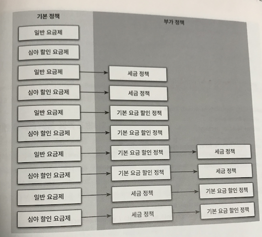
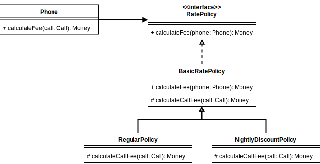
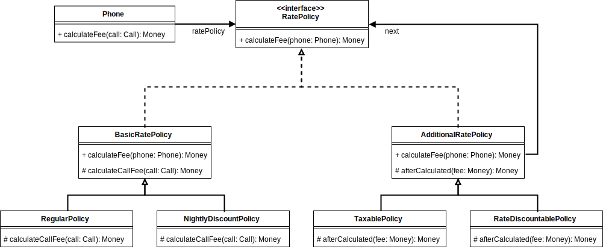

# 합성과 유연한 관계
상속은 **is-a 관계**, 합성은 **has-a 관계** 라고 해요. 또 상속은 서브 클래스에 의해서 재사용된다고
**화이트박스 재사용(white-box reuse)**, 합성은 내부의 공개 없이 인터페이스를 통해서만 재사용 되므로 **블랙박스
재사용(Black-box reuse)** 라고 부른대요.

## 01 상속을 합성으로 변경하기
상속이 좋지 않은게,

- 불필요한 인터페이스 상속 문제
    - `java.util.Properties` 나 `java.util.Stack` 같은 것들.
- 메서드 오버라이딩의 오작동 문제
    - `java.util.HashSet` 을 상속받는 `InstrumentedHashSet` 같이 부모 클래스의 메서드를
        호출할 때 문제가 발생되는 것.
- 부모 클래스와 자식 클래스의 동시 수정 문제

이런 이유로 상속을 합성으로 변경하는 거죠.

### 불필요한 인터페이스 상속 문제: `Properties` 와 `Stack`
선언된 부모 클래스를 필드 인스턴스로 만들면 끝!

```java
class Properties { 
  private Hashtable<String, String> properties = new Hashtable<>();
  
  public String setProperty(String key, String value) {
    return this.properties.put(key, value);
  }
  
  public String getProperty(String key) {
    return this.properties.get(key);
  }
} 
```
이러면 `String` 타입의 키와 값으로 제약된 규칙을 준수할 수 있어요.

```java
import java.util.EmptyStackException;class Stack<E> {
  private java.util.Vector<E> elements = new Vector<>();

  public E push(E item) {
    elements.addElement(item);
    return item;
  }
  
  public E pop() {
    if (elements.isEmpty())
      throw new EmptyStackException();

    return elements.get(elements.size() - 1);
  }
}
```
`push(...)` 로 특정 순서에 객체를 적재하는 문제를 해결해요. 진정한 스택 자료구조가 구현됐어요, 짜잔~👏👏

### 메서드 오버라이딩의 오작용 문제: InstrumentedHashSet
`Stack` 과 `Properties` 와는 좀 다른게, `InstrumentedHashSet` 은 `Set` interface
를 구현해야 해요.

```java
class InstrumentedHashSet<E> implements Set<E> {
  private int addCount = 0;
  private Set<E> set;
  
  public InstrumentedHashSet(Set<E> set) {
    this.set = set;
  }
  
  @Override
  public boolean add(E item) {
    addCount ++;
    return set.add(item);
  }
  
  @Override
  public boolean addAll(Collection<? extends E> items) {
    addCount += items.size();
    return set.addAll(items);
  }
  
  public int getAddCount() {
    return this.addCount;
  }
  
  @Override public boolean remove(E item) { return set.remove(item); }
  @Override public void clear() { set.clear(); }
  // ...
}
```

### 부모 클래스와 자식 클래스 동시 수정 문제: `PersonalPlaylist`
합성을 해도 어쩔 수 없이 연관된 클래스를 동시에 수정하는 문제에서 벗어 날 수 없는 경우가 있는데, 그렇다해도 변경에 대한 파급
효과를 따지면 상속보단 합성이래요.  
안정성과 유연성을 더 보장 받는 것 같아요.

## 02 상속으로 인한 조합의 폭발적인 증가
정책이 추가되는 걸 상속으로 구현하면서 클래스의 폭발💣 문제를 겪게 되는 거죠.
https://github.com/eternity-oop/object/tree/master/chapter11/src/main/java/org/eternity/billing/step04
코드는 너무 기이이이이이이이니까...

## 03 합성 관계로 변경하기
  
이 그림은 기본 정책과 부가 정책을 독립적인 박스로 표현하고 순서에 따라 조합됐어요.  
이게 바로 합성의 본질이라네요.

### 기본 정책 합성하기

제일 먼저 기본 정책과 부가 정책을 포괄하는 걸 하나 만들어요.
```java
interface RatePolicy {
  Money calculateFee(Phone phone);
} 
```
기본 정책을 구현해요.
```java
abstract class BasicRatePolicy implements RatePolicy {
  @Override
  public Money calculateFee(Phone phone) {
    Money result = Money.ZERO;
    
    for (Call call : phone.getCalls())
      result.plus(calculateCallFee(call));
  }
  
  protected abstract Money calculateCallFee(Call call);
}
```
이제 기본정책에 해당하는 일반요금제, 심야할인요금제를 구현 해요.
```java
@RequiredArgsConstructor
class RegularPolicy extends BasicRatePolicy {
  private final Money amount;
  private final Duration seconds;
  
  @Override
  protected Money calculateCallFee(Call call) {
    return amount.times(call.getDuration().getSeconds()
            / this.seconds.getSeconds());
  }
}

@RequiredArgsConstructor
class NightlyDiscountPolicy extends BasicRatePolicy {
  private static final int LATE_NIGHT_HOUR = 22;

  private final Money nightlyAmount;
  private final Money regularAmount;
  private final Duration seconds;
  
  @Override
  protected Money calculateCallFee(Call call) {
    if (call.getFrom().getHour() >= LATE_NIGHT_HOUR)
      return nightlyAmount.times(call.getDuration().getSeconds()
            / this.seconds.getSeconds());
    
    return regularAmount.times(call.getDuration().getSeconds()
            / this.seconds.getSeconds());
  }
}
```
지금까지 가꾼 다형성의 아름다운 꽃을 피워봐요.
```java
@RequiredArgsConstructor
class Phone {
  private final RatePolicy ratePolicy;
  private List<Call> calls = new ArrayList<>();
  
  public List<Call> getCalls() {
    return Collections.unmodifiableList(this.calls);
  }
  
  public Money calculateFee() {
    return ratePolicy.calculateFee(this);
  }
}
```
필드로 `RatePolicy` 가 있죠. 이것이 바로 합성이라고 강조해요. 이렇게 구현한 걸 다이어그램으로 표현하면  


괜찮네요.

일반요금제의 요금 계산은
```java
RatePolicy regularPolicy = new RegularPolicy(
    Money.won(10), 
    Duration.ofSeconds(10));
Phone phone = new Phone(regularPolicy);
```
이러면 되고, 야밤할인은
```java
RatePolicy regularPolicy = new NightlyDiscountPolicy(
    Money.won(5), 
    Money.won(10), 
    Duration.ofSeconds(10));
Phone phone = new Phone(regularPolicy);
```

부가 정책은 추상 클래스로 만들어요.
```java
@AllArgsConstructor
abstract class AdditionalRatePolicy implements RatePolicy {
  private RatePolicy next;
  
  @Override
  public Money calculateFee(Phone phone) {
    Money fee = next.calculateFee(phone);
    return afterCalculated(fee);
  }
  
  protected abstract Money afterCalculated(Money fee);
} 
```

좋아요, 맘에 들어요. 😀  
여기에 세금정책 을 만들면,
```java
class TaxablePolicy extends AdditionalRatePolicy {
  private double taxRatio;
  
  public TaxablePolicy(double taxRatio, RatePolicy next) {
    super(next);
    this.taxRatio = taxRatio;
  }
  
  @Override
  protected Money afterCalculated(Money fee) {
    return fee.plus(fee.times(this.taxRatio));
  }
}
```
기본요금 할인 정책도,
```java
class RateDiscountableDPolicy extends AdditionalRatePolicy {
  private Money discountAmount;
  
  public TaxablePolicy(Money discountAmount, RatePolicy next) {
    super(next);
    this.discountAmount = discountAmount;
  }
  
  @Override
  protected Money afterCalculated(Money fee) {
    return fee.minus(this.discountAmount);
  }
}
```
완벽해요. 🤓



### 기본 정책과 부가 정책 합성하기

만들었던 걸 사용하면,
```java
// 세금정책
RatePolicy taxablePolicy
    = new TaxablePolicy(0.05D, new RegularPolicy(...));

new Phone(taxablePolicy);

// 기본 요금 할인 정책 + 세금 정책
RatePolicy rateAndTaxPolicy
    = new RateDiscountablePolicy(
        Money.won(1000), taxablePolicy);

new Phone(rateAndTaxPolicy);
```
굿~👍

## 04 믹스인
객체를 생성할 때 코드 일부를 클래스 안에 섞어 넣어 재사용하는 방법을 믹스인 이라고 하는군요.  
전화 요금 정책을 구현했을 때, `next.calculateFee(...)` 같이 메서드 기능을 확장하는 걸.

재밌었네요, 이번 챕터도!
