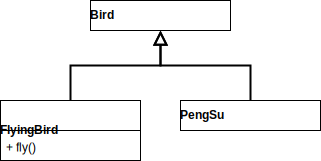

# 서브클리생과 서브타이핑
## 01 타입
객체가 수신할 수 있는 메세지의 집합을 가리키는게 **퍼블릭 인터페이스** 라는 의미를 찾기 위해 여러가지 설명이 있었어요~

## 02 타입 계층
슈퍼타입과 서브타입으로 나눠서 서로 퍼블릭 인터페이스를 정의하는데, 결국 관계를 형성하는게 퍼블릭 인터페이스라는 말씀!  
그리고, 서브타입은 슈퍼타입에 포함되어 상속과 다형성의 관계를 이해 할 수 있어요.

## 03 서브클래싱과 서브타이핑
상속을 사용하는 건,
- 상속 관계가 is-a 관계를 모델링하고,
- 클라이언트 입장에서 부모 클래스의 타입으로 자식 클래스를 사용해도 무방할 때.

위 2가지를 모두 충족할 때 상속을 사용하라고, 마틴 오더스키(스칼라 만든 분인가요?) 옹 께서 말씀하셨대요.

### is-a 관계
새는 날수 있어요. 팽귄은 새의 한 종류죠. 하지만 날 수 없어요.
```java
class Bird {
  public void fly() { 
    //...
  }
}

class PengSu extends Bird {
  // ...
}
```
이런 경우가 있으니, 조심해서 판단하래요.

### 행동 호환성 (클라이언트 입장에서 자식과 부모의 행동의 차이를 인식하지 못하는 것)
펭수는 날 수 없어요. 근데 자꾸 새니까 날으라고 한다는 거죠.  
이런식으로 설계하면 안된다는 거네요.

### 클라이언트의 기대에 따라 계층 분리하기
```java
class Bird {
}

class FlyingBird extends Bird {
  public void fly() {
    // ...
  }
}

class PengSu extends Bird {
}
```
  
이거 꽤, 괜찮다고 생각했는데, 인터페이스는 클라이언트가 기대하는 바에 따라 분리돼야 한대요. 더 나은 방법은,

  
이게 더 좋아 보이네요. 이처럼 클라이언트의 기대에 따라 분리하면서 변경의 영향을 제어하는 걸 **인터페이스 분리
원칙(Interface Segregation Principle, ISP) 라고 해요.

## 04 리스코프 치환 원칙
서브타입은 그것의 기반타입(슈퍼타입)과 대체가 가능해야 하는데, 이게 **Liskov Substitution Principle,
LSP** 래요.

## 05 계약에 의한 셀계와 서브타이핑
사전 조건을 정의하고 그에 따라 서브타입이 될 수 있고 없고, 사후 조건을 정의하고 더 약한지 강한지에 따라 서브타입이 될 수
있고 없고를 고민하게 하네요.  
상속은 타입 계층을 구현할 수 있는 전통적인 방법이지만 유일한 방법
다양한 방법이 있으니까...


