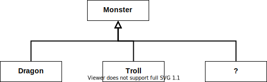
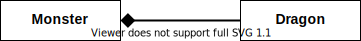

# 동적인 협력, 정적인 코드

프로그램 실행 구조를 표한하는 움직이는 모델 **동적 모델(Dynamic Model)**과 코드의 구조를 담고 있는 고정적인
**정적 모델(Static Model) 이라 한대요.

당연히 조화롭게 잘 버무리며 쓰는 능력이 필요한 거죠.  
동적 모델은 **객체와 협력** 으로 구성되고, **타입과 관계** 는 정적모델이라 할 수 있대요, 객체지향에서.

둘 중 무엇이 중요하냐고 묻는다면, 개발자가 자주 접하는 클래스등에 비춰 정적모델이 아니냐는 대답에 '노노~'.  
사실 지금까지 배워온게 "협력", "책임" 이런거니까요.

## 01 동적모델과 정적 모델

### 행동이 코드를 결정한다

"새는 날 수 있는데 펭귄도 새잖아!" 라고 하면서 정적모델을 미리 결정하고 객체의 행동을 정적 모델에 맞춰서는 안돼요.

### 변경을 고려하라
행동을 보고 적절하게 정적 모델을 만든다해도 변경을 고려하지 않으면 말짱 도루묵이란 말씀.

## 02 도메인 모델과 구현

### 도메인 모델에 관하여

> 도메인이란, 사용자가 프로그램을 사용하는 대상 역역을 가리킨다.  
> 모델이란, 지식을 선택적으로 단순화하고 의식적으로 구조화한 형태다.
> - Eric Evans

~~역시 도메인 얘기나오면 에반스 형님~~  
둘을 섞어 보면, 도메인 모델이라함은 사용자가 프로그램을 사용하는 대상 역역에 대한 지식을 선택적으로 단순화하고 의식적으로
구조화한 형태를 말한대요.

> 모델은 옳거나 틀린 것이 아니다. 모델은 유용하거나 유용하지 않은 정도의 차이만 있을 뿐이다.
> - Martin Fowler

### 몬스터 설계하기



이렇게 설계하겠죠. 딱히 나쁜게 없는 것 같은데 몬스터를 엄청나게 만들어 내면 객체도 많이 필요하고 코드도 많아 질 수 있다면서
구조를 바꿔요.

```java
@AllArgsConstructor
class Breed {
    private String monsterName;
    private String attack;
    
    @Getter
    private int health;
}

@RequiredArgsConstructor
class Monster {
    @Getter
    private int health;
    private Breed breed;
    
    public Monster(Breed breed) {
        this.breed = breed;
        this.health = breed.getHealth();
    }
}
```

이렇게 해서 상속보다는 합성을 사용했네요. 실제로 몬스터 인스턴스를 만들면

```java
Monster dragon = new Monster(new Breed("Dragon"), 230, "Fiiiiiiire!");
Monster troll = new Monster(new Breed("Troll"), 48, "Hiiiting");
```



이처럼 어떤 인스턴스가 다른 인스턴스의 타입을 표현하는 방법을 **TYPE OBJECT 패턴** 이라고 한대요.

#### 행동과 변경을 고려한 도메인 모델
 초기에 고안한 도메인 모델은 좋은 출발점이 될 수는 있지만 객체의 행동과 변경이라는 요소를 고려하면 빠르게 그 가치가
 떨어진대요. 그럴 때 더 나은 아이디어가 떠오른다면 미련없이 바꾸래요. ~~이게 현실이 되려면, 도메인별로 분할된 DDD 가
 되어 있어야 하지 않을까...~~

### 분석 모델, 설계 모델, 그리고 구현 모델

> 객체지향의 가장 큰 힘은 도메인을 표현하는 방법과 프로그램 코드를 표현하는 방법이 동일하다는 것이다
> 만약 객체지향 언어를 사용하고 있다면 프로그램 코드를 설계 문서로 간주할 수 있는 기반은 갖춰진 셈이다.
> - 조영호

행동과 변경...  
거의 모든 챕터, 몇 쪽에 한번씩은 나온 말인것 같네요. 그만큼 중요하단 얘기겠죠? 끝!
